# **Data Analysis Case Study**

### **Part 1:**

You have been asked to prepare analysis on part-time employees to brief your Director prior to a meeting they are attending with the Workforce Diversity Steering Committee to review whether part-time employment arrangements are increasing.

Please provide:

- **Trends over time in male and female employment, including any notable changes**

  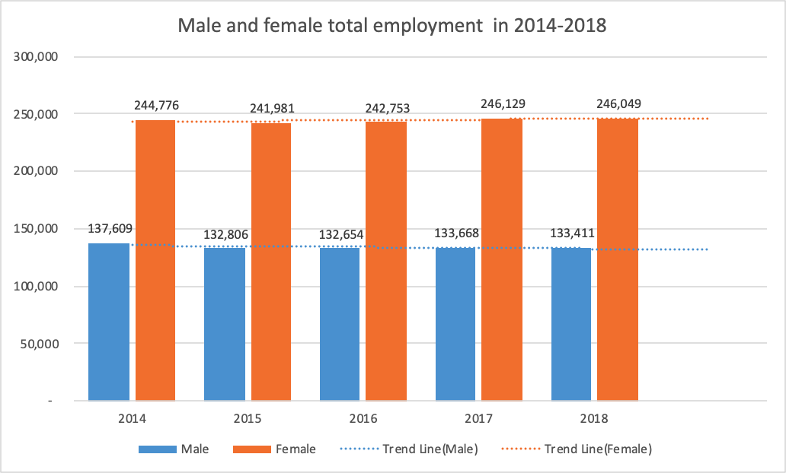

  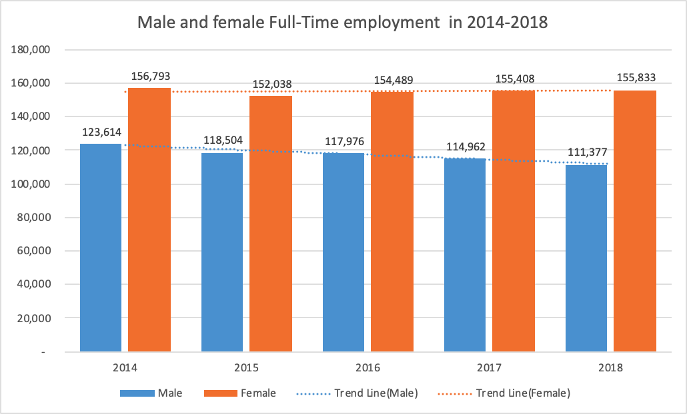

  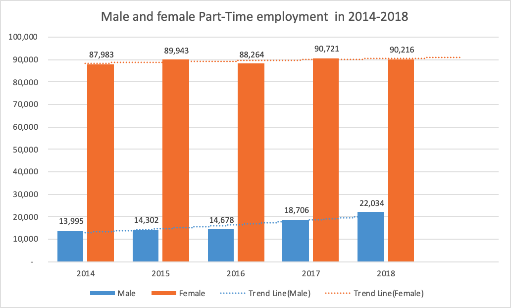

  For sum of full-time and part-time, the male and female employment both have an overall smooth curve with only slight differences over time during 2014-2018. For full-time employment during 2014-2018, the male employment has a small decrease about 12,000, and female employment remain almost unchanged. For part-time, the male employment has a huge increase from 13,995 to 22,034, and female employment has rather smaller increase from 87,983 to 90,216.

  

- **The current representation of part time employees in the sector and in each Cluster**

  We use IF function to compare part-time male and female employees and take the majority sexuality as the current representation in each Sector and each Cluster.

  For example in <u>Year 2018</u>:

  | Section/Agency                           | Current Representation Sexuality |
  | ---------------------------------------- | -------------------------------- |
  | Education  Agency 1                      | Female                           |
  | Education  Agency 2                      | Male                             |
  | Education  Agency 3                      | Female                           |
  | Education  Agency 4                      | Female                           |
  | Family &  Community Services Agency 1    | Female                           |
  | Family &  Community Services Agency 2    | Female                           |
  | Family &  Community Services Agency 3    | Female                           |
  | Finance,  Services & Innovation Agency 1 | Female                           |
  | Finance,  Services & Innovation Agency 2 | Female                           |
  | Health Agency  1                         | Female                           |
  | Health Agency  10                        | Female                           |
  | Health Agency  11                        | Female                           |
  | Health Agency  12                        | Female                           |
  | Health Agency  13                        | Female                           |
  | Health Agency  14                        | Female                           |
  | Health Agency  15                        | Female                           |
  | Health Agency  16                        | Female                           |
  | Health Agency  17                        | Female                           |
  | Health Agency  18                        | Female                           |
  | Health Agency  19                        | Female                           |
  | Health Agency  2                         | Female                           |
  | Health Agency  20                        | Female                           |
  | Health Agency  21                        | Female                           |
  | Health Agency  22                        | Female                           |
  | Health Agency  23                        | Female                           |
  | Health Agency  24                        | Female                           |
  | Health Agency  25                        | Female                           |
  | Health Agency  26                        | Female                           |
  | Health Agency  27                        | Female                           |
  | Health Agency  28                        | Female                           |
  | Health Agency  29                        | Female                           |
  | Health Agency  3                         | Female                           |
  | Health Agency  30                        | Female                           |
  | Health Agency  31                        | Female                           |
  | Health Agency  32                        | Female                           |
  | Health Agency  33                        | Female                           |
  | Health Agency  4                         | Male                             |
  | Health Agency  5                         | Female                           |
  | Health Agency  6                         | Female                           |
  | Health Agency  7                         | Female                           |
  | Health Agency  8                         | Female                           |
  | Health Agency  9                         | Female                           |
  | Industry  Agency 1                       | Female                           |
  | Industry  Agency 2                       | Female                           |
  | Industry  Agency 3                       | Female                           |
  | Industry  Agency 4                       | Female                           |
  | Industry  Agency 5                       | Female                           |
  | Industry  Agency 6                       | Male                             |
  | Industry  Agency 7                       | Female                           |
  | Industry  Agency 8                       | Female                           |
  | Justice Agency  1                        | Female                           |
  | Justice Agency  10                       | Female                           |
  | Justice Agency  11                       | Female                           |
  | Justice Agency  12                       | Female                           |
  | Justice Agency  13                       | Female                           |
  | Justice Agency  14                       | Female                           |
  | Justice Agency  2                        | Female                           |
  | Justice Agency  3                        | Female                           |
  | Justice Agency  4                        | Male                             |
  | Justice Agency  5                        | Female                           |
  | Justice Agency  6                        | Female                           |
  | Justice Agency  7                        | Female                           |
  | Justice Agency  8                        | Female                           |
  | Justice Agency  9                        | Female                           |
  | Planning &  Environment Agency 1         | Female                           |
  | Planning &  Environment Agency 2         | Female                           |
  | Planning &  Environment Agency 3         | Female                           |
  | Planning &  Environment Agency 4         | Female                           |
  | Planning &  Environment Agency 5         | Female                           |
  | Planning &  Environment Agency 6         | Female                           |
  | Planning &  Environment Agency 7         | Female                           |
  | Planning &  Environment Agency 8         | Female                           |
  | Premier &  Cabinet Agency 1              | Female                           |
  | Premier &  Cabinet Agency 10             | Female                           |
  | Premier &  Cabinet Agency 11             | Female                           |
  | Premier &  Cabinet Agency 2              | Female                           |
  | Premier &  Cabinet Agency 3              | Female                           |
  | Premier &  Cabinet Agency 4              | Female                           |
  | Premier &  Cabinet Agency 5              | Female                           |
  | Premier &  Cabinet Agency 6              | Male                             |
  | Premier &  Cabinet Agency 7              | Female                           |
  | Premier &  Cabinet Agency 8              | Female                           |
  | Premier &  Cabinet Agency 9              | Female                           |
  | Transport  Agency 1                      | Female                           |
  | Transport  Agency 2                      | Female                           |
  | Transport  Agency 3                      | Female                           |
  | Transport  Agency 4                      | Male                             |
  | Transport  Agency 5                      | Male                             |
  | Transport  Agency 6                      | Male                             |
  | Treasury  Agency 1                       | Female                           |
  | Treasury  Agency 2                       | Female                           |
  | Treasury  Agency 3                       | Female                           |

  For example in <u>Year 2018</u>:

  | Cluster                         | Current Representation Sexuality | Count(Male+Female) |
  | ------------------------------- | -------------------------------- | ------------------ |
  | Education                       | Female                           | 47,939             |
  | Family  & Community Services    | Female                           | 1,512              |
  | Finance,  Services & Innovation | Female                           | 2,058              |
  | Health                          | Female                           | 48500              |
  | Industry                        | Female                           | 813                |
  | Justice                         | Female                           | 5021               |
  | Planning  & Environment         | Female                           | 1553               |
  | Premier  & Cabinet              | Female                           | 363                |
  | Transport                       | Male                             | 4343               |
  | Treasury                        | Female                           | 148                |

- **The current representation of male and female part time employees as a proportion of the respective male and the female workforce in the sector and in each cluster**

  Male employees in 2018:

  | Cluster                       | Count |
  | :---------------------------- | :---- |
  | Education                     | 8783  |
  | Family & Community Services   | 113   |
  | Finance Services & Innovation | 690   |
  | Health                        | 7498  |
  | Industry                      | 114   |
  | Justice                       | 1447  |
  | Planning & Environment        | 302   |
  | Premier & Cabinet             | 71    |
  | Transport                     | 2998  |
  | Treasury                      | 18    |

  

Female employees in 2018:

| Cluster                       | Count |
| :---------------------------- | :---- |
| Education                     | 39156 |
| Family & Community Services   | 1399  |
| Finance Services & Innovation | 1368  |
| Health                        | 41002 |
| Industry                      | 699   |
| Justice                       | 3574  |
| Planning & Environment        | 1251  |
| Premier & Cabinet             | 292   |
| Transport                     | 1345  |
| Treasury                      | 130   |

| Gender | Part-Time Count (2018) | Percent(%) |
| :----- | :--------------------- | :--------- |
| Male   | 22034                  | 19.629     |
| Female | 90216                  | 80.371     |

- **Change in these two above statistics over the last 4 years**

  | Cluster                       | Year | Headcount |
  | :---------------------------- | :--- | :-------- |
  | Education                     | 2014 | 101731    |
  | Education                     | 2015 | 101430    |
  | Education                     | 2016 | 105238    |
  | Education                     | 2017 | 106928    |
  | Education                     | 2018 | 108454    |
  | Family & Community Services   | 2014 | 20656     |
  | Family & Community Services   | 2015 | 20351     |
  | Family & Community Services   | 2016 | 15885     |
  | Family & Community Services   | 2017 | 15514     |
  | Family & Community Services   | 2018 | 10676     |
  | Finance Services & Innovation | 2014 | 7638      |
  | Finance Services & Innovation | 2015 | 8436      |
  | Finance Services & Innovation | 2016 | 8383      |
  | Finance Services & Innovation | 2017 | 8518      |
  | Finance Services & Innovation | 2018 | 8518      |
  | Health                        | 2014 | 135970    |
  | Health                        | 2015 | 138087    |
  | Health                        | 2016 | 139982    |
  | Health                        | 2017 | 141911    |
  | Health                        | 2018 | 146312    |
  | Industry                      | 2014 | 28239     |
  | Industry                      | 2015 | 17134     |
  | Industry                      | 2016 | 16565     |
  | Industry                      | 2017 | 16194     |
  | Industry                      | 2018 | 12202     |
  | Justice                       | 2014 | 44602     |
  | Justice                       | 2015 | 45473     |
  | Justice                       | 2016 | 45631     |
  | Justice                       | 2017 | 46001     |
  | Justice                       | 2018 | 47498     |
  | Planning & Environment        | 2014 | 9772      |
  | Planning & Environment        | 2015 | 9662      |
  | Planning & Environment        | 2016 | 9841      |
  | Planning & Environment        | 2017 | 10636     |
  | Planning & Environment        | 2018 | 10947     |
  | Premier & Cabinet             | 2014 | 2063      |
  | Premier & Cabinet             | 2015 | 2084      |
  | Premier & Cabinet             | 2016 | 2410      |
  | Premier & Cabinet             | 2017 | 2588      |
  | Premier & Cabinet             | 2018 | 2810      |
  | Transport                     | 2014 | 29759     |
  | Transport                     | 2015 | 30104     |
  | Transport                     | 2016 | 29555     |
  | Transport                     | 2017 | 30129     |
  | Transport                     | 2018 | 30524     |
  | Treasury                      | 2014 | 1955      |
  | Treasury                      | 2015 | 2026      |
  | Treasury                      | 2016 | 1917      |
  | Treasury                      | 2017 | 1378      |
  | Treasury                      | 2018 | 1519      |

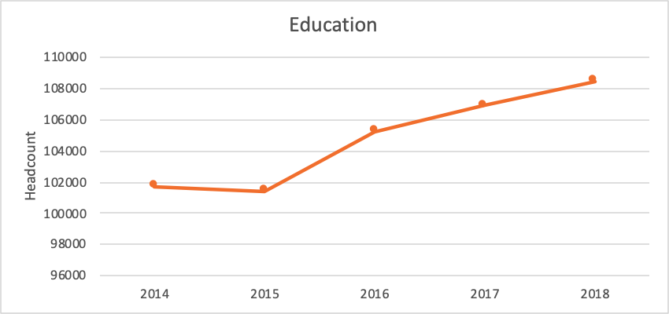

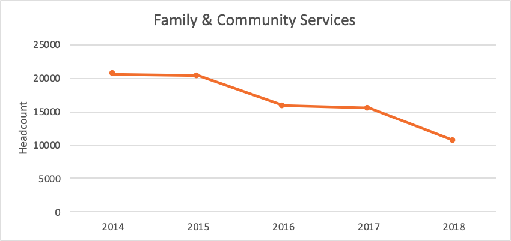

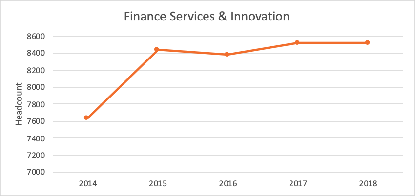

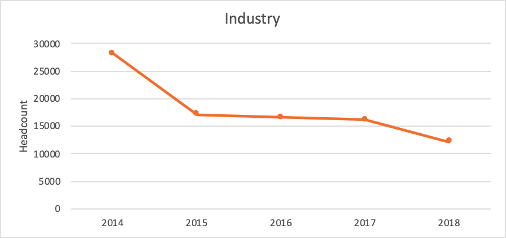

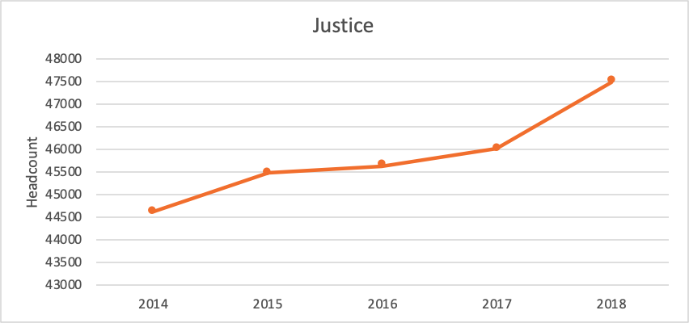

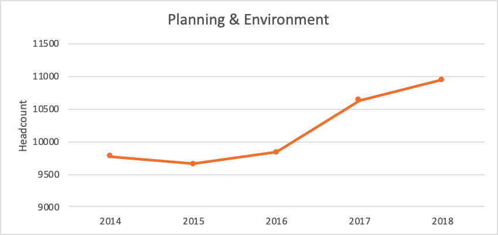

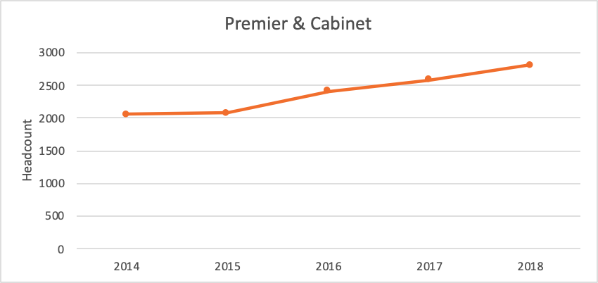

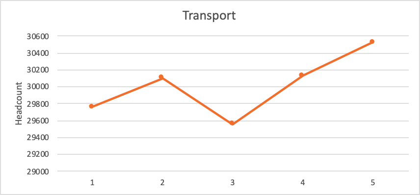

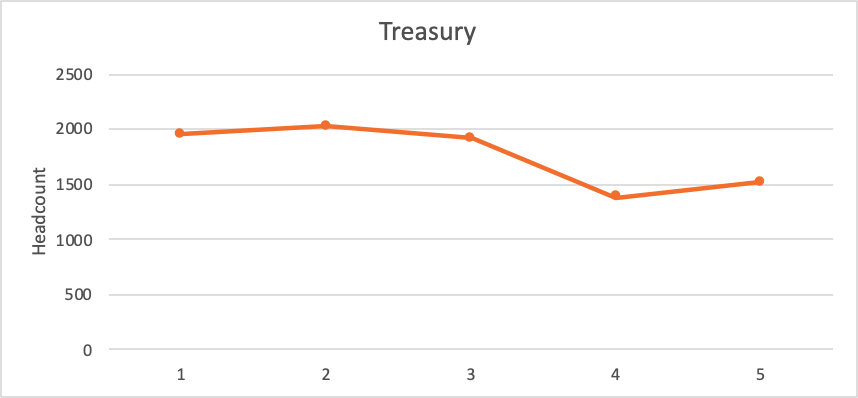

- **Projection of what the representation will be by 2025 if the current trends continue**

  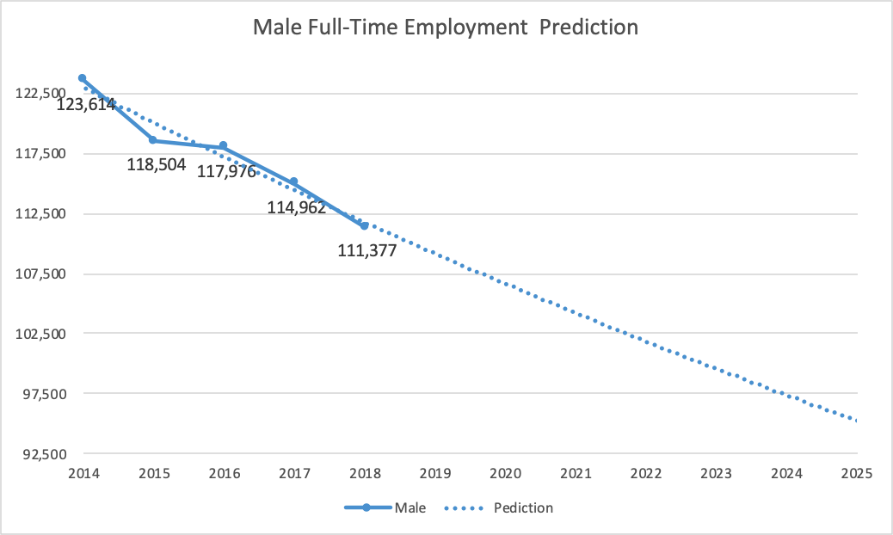
  
  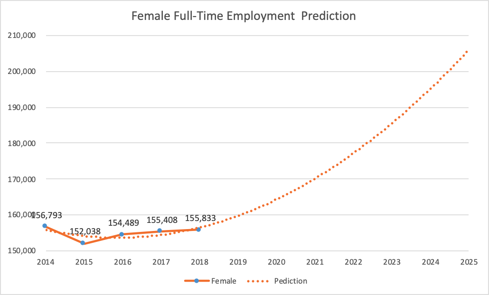
  
  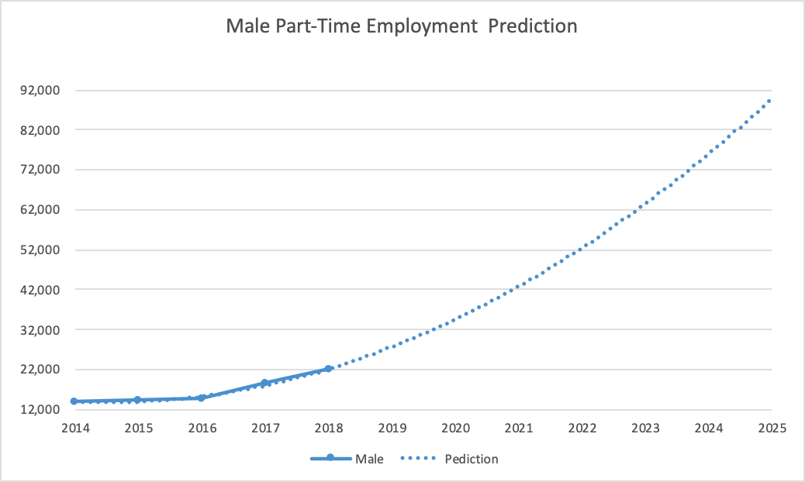
  
  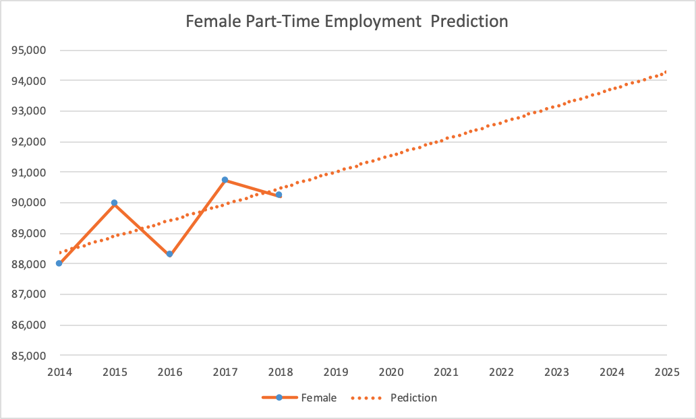

### **Part 2:**

Please prepare a discussion paper (maximum 4 A4 pages of content or 6 presentation slides) of your analysis that would be suitable for a Director to use as a discussion aid in a meeting with senior executives. You must include tables or charts that illustrate your findings.

*“This work has the potential to influence the direction of a sector wide target, so it needs to be of the highest quality ...”*

**We recommend you spend around 1 hour and 30 minutes on this task.**